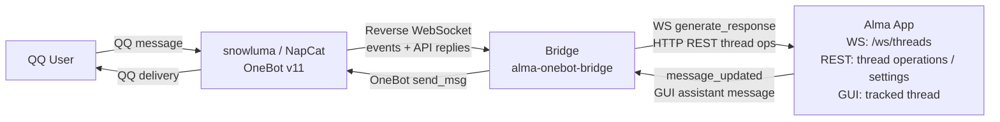

<p align="center">
  
</p>

# Alma OneBot Bridge

A bridge service that connects [Alma](https://github.com/anthropics/alma) to QQ through [OneBot v11](https://github.com/botuniverse/onebot-11). Alma replies in QQ private chats and groups through a reverse WebSocket connection.

## Features

- **Alma pipeline**: Messages use Alma's WebSocket protocol, so SOUL, Memory, People Profiles, and Skills apply.
- **Bidirectional sync**: Alma GUI messages forward to QQ. QQ messages create or reuse Alma threads.
- **Group chat support**: Groups require @mentions. The bridge uses the sender's group card as display name.
- **Group chat history**: The bridge injects recent group messages into context and writes logs under `~/.config/alma/groups`.
- **Alma group CLI compatibility**: `alma group list/history/search/context` can read QQ group logs. Active QQ sends use bridge HTTP endpoints because `alma group send` targets Telegram.
- **Rich message handling**: The bridge converts QQ face emojis to text, labels images/voice/video, and extracts forwarded message content.
- **Reply and @mention**: Incoming quotes and outgoing reply references work. Group replies mention the sender.
- **People Profiles**: The bridge creates Alma People Profile files for QQ users with `qq_id` frontmatter.
- **Message splitting**: Long replies split by paragraph, then by QQ's 4500-character limit.
- **Persistent state**: Turso stores thread mappings, user profiles, QQ group titles, and group card metadata.
- **Security**: WebSocket auth can require a `Bearer` token. HTTP send endpoints accept loopback or a valid token.
- **Config**: Use TOML config or the macOS settings window.
- **Desktop apps**: macOS and Windows tray/menu bar apps manage the bridge, settings, logs, start/stop/restart, and quit.

## Architecture



The bridge acts as a **WebSocket server** for the OneBot client and a **WebSocket client** for Alma's internal chat pipeline (`ws://localhost:23001/ws/threads`).

## Quick Start

### Prerequisites

- [Alma](https://github.com/anthropics/alma) running locally (`alma status` to verify)
- A OneBot v11 client (e.g., [snowluma](https://github.com/nickyc975/snowluma) or NapCat) configured for reverse WebSocket
- Rust toolchain (1.85+, edition 2024)

### Build

```bash
git clone <repo-url>
cd alma-onebot-bridge
cargo build --release
```

### macOS Menu Bar App

The macOS app runs the Rust bridge from the menu bar. It starts and stops the
bridge, opens Preferences, writes `~/.config/alma/bridge/config.toml`, and keeps
logs next to that config.

Build the app bundle:

```bash
./scripts/build-macos.sh
```

The script writes:

```text
platforms/macos/build/Build/Products/Release/AlmaOneBotBridge.app
```

Install it into `/Applications` for Launchpad:

```bash
INSTALL_TO_APPLICATIONS=1 ./scripts/build-macos.sh
```

Build a PKG installer with license acceptance:

```bash
./scripts/package-macos-pkg.sh
```

macOS guide: [platforms/macos/README.md](./platforms/macos/README.md).

### Windows Tray App

The Windows app is a Rust + WinUI tray app that runs the bridge in-process with
no console window. Release packaging produces both a Velopack installer and a
portable ZIP:

```powershell
.\scripts\package-windows-velopack.ps1
.\scripts\package-windows-zip.ps1
```

The MSI is per-machine under Program Files. The ZIP contains the runnable WinUI
payload for portable use.

Windows guide: [platforms/windows/README.md](./platforms/windows/README.md).

### Configure

Copy the example config and edit as needed:

```bash
cp config.toml.example config.toml
# Edit config.toml with your preferred settings
```

Key settings in `config.toml`:

```toml
[bridge]
port = 8090

[alma]
api = "http://localhost:23001"
# model = "anthropic:claude-sonnet-4-20250514"  # Override default model
timeout = 120

[onebot]
api_timeout = 30
# access_token = ""  # Uncomment to require Bearer token on WS connections

[chat]
group_history_size = 30        # Recent group messages for AI context (0 = disabled)
# thinking_message = "思考中..."  # Optional message before AI generation
```

> **Note**: Git ignores `config.toml`. The repo tracks only `config.toml.example`.

### Configure OneBot Client

Add a reverse WebSocket connection in your OneBot client config. For snowluma, edit `/app/snowluma-data/config/onebot_<qq_id>.json`:

```json
{
  "networks": {
    "wsClients": [
      {
        "name": "Alma",
        "url": "ws://<bridge-host>:8090/ws",
        "messageFormat": "array",
        "reportSelfMessage": false,
        "role": "Universal",
        "reconnectIntervalMs": 5000
      }
    ]
  }
}
```

If the OneBot client runs in Docker, use `host.docker.internal` as `<bridge-host>`.

### Run

```bash
# Start the bridge
./target/release/alma-onebot-bridge

# Or with debug logging
RUST_LOG=debug ./target/release/alma-onebot-bridge

# Local debugger mode: uses a temporary DB and the first available port from 18090
RUST_LOG=debug ./target/debug/alma-onebot-bridge --debugger
```

Startup order: Alma → Bridge → OneBot client.

`--debugger` mode is intended for local IDE/debugger launches while another
bridge may already be running. It uses a per-process temporary database and
chooses the first available port starting at `18090`.

## Configuration Reference

| TOML Key | Default | Description |
|----------|---------|-------------|
| `bridge.port` | `8090` | Listen port |
| `alma.api` | `http://localhost:23001` | Alma API base URL |
| `alma.model` | *(Alma settings)* | Override AI model |
| `alma.timeout` | `120` | Generation timeout (seconds) |
| `alma.max_retries` | `2` | Retry attempts for failed generations |
| `alma.retry_delay_ms` | `3000` | Base retry delay (ms, exponential backoff) |
| `database.path` | `bridge-state.db` | Database file path |
| `people.dir` | `~/.config/alma/people` | People profiles directory |
| `onebot.api_timeout` | `30` | OneBot API timeout (seconds) |
| `onebot.access_token` | *(none)* | Bearer token for WS auth and non-loopback HTTP command endpoints |
| `chat.group_history_size` | `30` | Group history context size (0 = disabled) |
| `chat.thinking_message` | *(none)* | Pre-generation indicator message |
| `chat.show_thinking` | `false` | Send thinking blocks as separate QQ messages |

## How It Works

### Message Flow (QQ → Alma → QQ)

1. QQ user sends a message (or @mentions the bot in a group)
2. OneBot client pushes the event to the bridge via reverse WebSocket
3. Bridge extracts text, face emojis, and media info; records to in-memory group history and `~/.config/alma/groups/<group_id>_<date>.log`
4. Bridge handles reply/quoting context and forwarded message extraction
5. Bridge ensures a People Profile exists for the user
6. Bridge finds or creates an Alma thread (keyed by `private:{user_id}` or `group:{group_id}`)
7. Bridge sends `generate_response` via Alma WebSocket with sender identity and ephemeral context
8. Alma processes with full pipeline (SOUL + Memory + People Profiles)
9. Bridge collects the response and sends it back to QQ (with reply reference and @mention for groups)

### Bidirectional Sync (Alma GUI → QQ)

Messages typed in the Alma GUI for a tracked thread are forwarded to QQ. A dedup mechanism (first 100 characters) prevents echo loops when the bridge itself generates replies.

### Alma Group Commands and Active Sends

The bridge writes QQ group logs in Alma's native group-log format:

```bash
alma group list
alma group history <qq_group_id> 100
alma group search <keyword>
alma group context <qq_group_id>
cat ~/.config/alma/groups/README.md
```

Inside `~/.config/alma/groups/README.md`, the bridge edits only its marked `alma-onebot-bridge` section and leaves the rest alone. People Profiles store members and group cards.

For QQ groups, `alma group send` remains a Telegram command inside Alma. Use the bridge endpoint for active QQ sends:

```bash
curl -s -X POST http://127.0.0.1:8090/qq/group/<qq_group_id>/send \
  -H 'Content-Type: application/json' \
  -d '{"message":"hello"}'
```

Private QQ sends use `POST /qq/private/<qq_user_id>/send` with the same JSON body. If the request is not from loopback, configure `onebot.access_token` and send it as `Authorization: Bearer <token>`.

### Sender Identity

The bridge formats messages for Alma's channel bridge protocol:

- Group: `[From: Alice [id:12345678] [msg:12345]] 消息内容`
- Private: `[msg:67890] 消息内容`
- With quote: `[From: Alice [id:12345678] [msg:12346]] [Replying to Bob's message: "之前的话"] 这是回复`

For group messages, `[msg:N]` stays inside the `[From: ...]` sender header, matching Alma's built-in Telegram/Discord bridge format. Private messages omit `[From: ...]`. `[msg:N]` uses the OneBot message ID; group `[id:N]` uses the sender QQ ID. The bridge converts face emojis to text such as `[emoji:斜眼笑]` and labels images, voice, and video.

## WebSocket Paths

The bridge accepts OneBot connections at:

- `/`: generic
- `/ws`: NapCat / snowluma default
- `/onebot/v11/ws`: Lagrange default

## Development

```bash
# Debug build
cargo build

# Run with full debug logging
RUST_LOG=debug cargo run

# Release build
cargo build --release
```

Technical notes: [DEVELOPMENT_KNOWLEDGE_BASE.md](./src/docs/DEVELOPMENT_KNOWLEDGE_BASE.md).

## License

[AGPL-3.0](./LICENSE), GNU Affero General Public License v3.0
