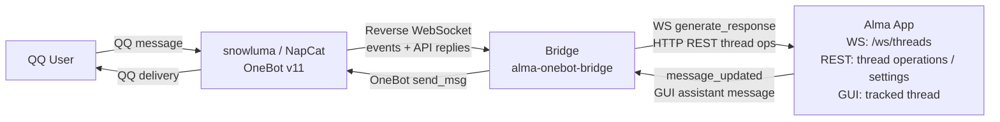

# Alma OneBot Bridge

A bridge service that connects [Alma](https://github.com/anthropics/alma) (local AI chat assistant) to QQ via the [OneBot v11](https://github.com/botuniverse/onebot-11) protocol. It enables Alma to serve as a bot in QQ private and group chats using a reverse WebSocket architecture.

## Features

- **Full Alma pipeline** — Messages go through Alma's WebSocket protocol, so SOUL, Memory, People Profiles, and Skills all work as expected
- **Bidirectional sync** — Messages sent from the Alma GUI are forwarded to QQ, and vice versa
- **Group chat support** — Responds to @mentions in group chats, with group card (群名片) as display name
- **Group chat history** — Injects recent group messages into AI context and writes QQ group logs to Alma's native `~/.config/alma/groups` directory
- **Alma group CLI compatibility** — `alma group list/history/search/context` can see QQ group logs; active QQ sends use bridge HTTP endpoints because `alma group send` is Telegram-only
- **Rich message handling** — Face emojis converted to readable text (`[emoji:斜眼笑]`), images/voice/video described with labels, forwarded messages summarized with content extraction
- **Reply & @mention** — Full reply/quoting protocol (incoming quotes and outgoing reply references), with automatic @mention in group replies
- **People Profiles** — Automatically creates Alma People Profile files for each QQ user, with `qq_id` frontmatter for cross-platform identity matching
- **Message splitting** — Long replies are split by paragraph and QQ's 4500-character limit
- **Persistent state** — Thread mappings, user profiles, QQ group titles, and group card metadata stored in a Turso database
- **Security** — Optional WebSocket access token authentication (`Bearer` header); HTTP send endpoints allow loopback or a valid token
- **Configurable** — TOML config file with environment variable overrides
- **Native macOS app** — Menu bar app that launches and supervises the bridge, with native settings, logs, start/stop/restart, and quit controls

## Architecture



The bridge acts as a **WebSocket server** for the OneBot client and a **WebSocket client** for Alma's internal chat pipeline (`ws://localhost:23001/ws/threads`).

## Quick Start

### Prerequisites

- [Alma](https://github.com/anthropics/alma) running locally (`alma status` to verify)
- A OneBot v11 client (e.g., [snowluma](https://github.com/nickyc975/snowluma) or NapCat) configured for reverse WebSocket
- Rust toolchain (1.85+, edition 2024)

### Build

```bash
git clone <repo-url>
cd alma-onebot-bridge
cargo build --release
```

### macOS Menu Bar App

The native macOS app wraps the Rust bridge as a supervised background process.
Opening `AlmaOneBotBridge.app` from Finder or Launchpad starts the bridge, keeps a
menu bar icon visible, and stops the bridge when you quit the app.

Build the app bundle:

```bash
./scripts/build-macos.sh
```

The output is:

```text
platforms/macos/build/Build/Products/Release/AlmaOneBotBridge.app
```

To make it available from Launchpad, copy it to `/Applications` or let the build
script install it:

```bash
INSTALL_TO_APPLICATIONS=1 ./scripts/build-macos.sh
```

The app stores its editable config and runtime log under:

```text
~/.config/alma/bridge/config.toml
~/.config/alma/bridge/bridge.log
~/.config/alma/bridge/bridge.pid
```

The menu bar controls expose **Start**, **Stop**, **Restart**, **Preferences**,
**Open Config Directory**, **Open Bridge Log**, and **Quit**. Saving preferences
hot-reloads chat/model/timeout settings with `SIGHUP`; changes that cannot be
hot-reloaded safely, such as the listen port, Alma API URL, access token, or DB
path, automatically restart the supervised bridge process.

### Configure

Copy the example config and edit as needed:

```bash
cp config.toml.example config.toml
# Edit config.toml with your preferred settings
```

Key settings in `config.toml`:

```toml
[bridge]
port = 8090

[alma]
api = "http://localhost:23001"
# model = "anthropic:claude-sonnet-4-20250514"  # Override default model
timeout = 120

[onebot]
api_timeout = 30
# access_token = ""  # Uncomment to require Bearer token on WS connections

[chat]
group_history_size = 30        # Recent group messages for AI context (0 = disabled)
# thinking_message = "思考中..."  # Optional message before AI generation
```

> **Note**: `config.toml` is in `.gitignore` — it won't be committed to git. Only `config.toml.example` is tracked.

Environment variables override config file values (e.g., `ALMA_MODEL`, `BRIDGE_PORT`).

### Configure OneBot Client

Add a reverse WebSocket connection in your OneBot client config. For snowluma, edit `/app/snowluma-data/config/onebot_<qq_id>.json`:

```json
{
  "networks": {
    "wsClients": [
      {
        "name": "Alma",
        "url": "ws://<bridge-host>:8090/ws",
        "messageFormat": "array",
        "reportSelfMessage": false,
        "role": "Universal",
        "reconnectIntervalMs": 5000
      }
    ]
  }
}
```

If the OneBot client runs in Docker, use `host.docker.internal` as `<bridge-host>`.

### Run

```bash
# Start the bridge
./target/release/alma-onebot-bridge

# Or with debug logging
RUST_LOG=debug ./target/release/alma-onebot-bridge

# Local debugger mode: avoids the default DB and port unless explicitly overridden
RUST_LOG=debug ./target/debug/alma-onebot-bridge --debugger
```

Startup order: Alma → Bridge → OneBot client.

`--debugger` mode is intended for local IDE/debugger launches while another
bridge may already be running. If `DB_PATH` is not set, it uses a per-process
temporary database; if `BRIDGE_PORT` is not set, it chooses the first available
port starting at `18090`.

## Configuration Reference

| Variable | TOML Key | Default | Description |
|----------|----------|---------|-------------|
| `BRIDGE_PORT` | `bridge.port` | `8090` | Listen port |
| `ALMA_API` | `alma.api` | `http://localhost:23001` | Alma API base URL |
| `ALMA_MODEL` | `alma.model` | *(Alma settings)* | Override AI model |
| `ALMA_TIMEOUT` | `alma.timeout` | `120` | Generation timeout (seconds) |
| `ALMA_MAX_RETRIES` | `alma.max_retries` | `2` | Retry attempts for failed generations |
| `ALMA_RETRY_DELAY` | `alma.retry_delay_ms` | `3000` | Base retry delay (ms, exponential backoff) |
| `DB_PATH` | `database.path` | `bridge-state.db` | Database file path |
| `PEOPLE_DIR` | `people.dir` | `~/.config/alma/people` | People profiles directory |
| `ONEBOT_API_TIMEOUT` | `onebot.api_timeout` | `30` | OneBot API timeout (seconds) |
| `ACCESS_TOKEN` | `onebot.access_token` | *(none)* | Bearer token for WS auth and non-loopback HTTP command endpoints |
| `GROUP_HISTORY_SIZE` | `chat.group_history_size` | `30` | Group history context size (0 = disabled) |
| `THINKING_MESSAGE` | `chat.thinking_message` | *(none)* | Pre-generation indicator message |
| `RUST_LOG` | — | `info` | Log level (env-filter syntax) |
| `BRIDGE_LOG_FILE` | — | *(stderr)* | Optional log file path; used by the macOS app for `bridge.log` |

## How It Works

### Message Flow (QQ → Alma → QQ)

1. QQ user sends a message (or @mentions the bot in a group)
2. OneBot client pushes the event to the bridge via reverse WebSocket
3. Bridge extracts text, face emojis, and media info; records to in-memory group history and `~/.config/alma/groups/<group_id>_<date>.log`
4. Bridge handles reply/quoting context and forwarded message extraction
5. Bridge ensures a People Profile exists for the user
6. Bridge finds or creates an Alma thread (keyed by `private:{user_id}` or `group:{group_id}`)
7. Bridge sends `generate_response` via Alma WebSocket with sender identity and ephemeral context
8. Alma processes with full pipeline (SOUL + Memory + People Profiles)
9. Bridge collects the response and sends it back to QQ (with reply reference and @mention for groups)

### Bidirectional Sync (Alma GUI → QQ)

Messages typed in the Alma GUI for a tracked thread are forwarded to QQ. A dedup mechanism (first 100 characters) prevents echo loops when the bridge itself generates replies.

### Alma Group Commands and Active Sends

The bridge writes QQ group logs in Alma's native group-log format:

```bash
alma group list
alma group history <qq_group_id> 100
alma group search <keyword>
alma group context <qq_group_id>
cat ~/.config/alma/groups/README.md
```

Inside `~/.config/alma/groups/README.md`, the bridge only maintains its own `alma-onebot-bridge` marked section and preserves any content outside that section. This section intentionally does not list known members or group cards; those belong in People Profiles to avoid duplicating identity data.

For QQ groups, `alma group send` remains a Telegram command inside Alma. Use the bridge endpoint for active QQ sends:

```bash
curl -s -X POST http://127.0.0.1:8090/qq/group/<qq_group_id>/send \
  -H 'Content-Type: application/json' \
  -d '{"message":"hello"}'
```

Private QQ sends use `POST /qq/private/<qq_user_id>/send` with the same JSON body. If the request is not from loopback, configure `ACCESS_TOKEN` and send it as `Authorization: Bearer <token>`.

### Sender Identity

Messages are formatted to match Alma's channel bridge protocol (Telegram-style):

- Group: `[From: Alice [id:12345678] [msg:12345]] 消息内容`
- Private: `[msg:67890] 消息内容`
- With quote: `[From: Alice [id:12345678] [msg:12346]] [Replying to Bob's message: "之前的话"] 这是回复`

For group messages, `[msg:N]` is part of the `[From: ...]` sender header, matching Alma's built-in Telegram/Discord bridge format. Private messages do not include a `[From: ...]` header. The `[msg:N]` tag uses the real OneBot message ID; `[id:N]` uses the sender QQ ID in group messages. Face emojis are converted to text (e.g., `[emoji:斜眼笑]`), and images/voice/video are described with labels.

## WebSocket Paths

The bridge accepts OneBot connections at:

- `/` — generic
- `/ws` — NapCat / snowluma default
- `/onebot/v11/ws` — Lagrange default

## Development

```bash
# Debug build
cargo build

# Run with full debug logging
RUST_LOG=debug cargo run

# Release build
cargo build --release
```

See [DEVELOPMENT_KNOWLEDGE_BASE.md](./DEVELOPMENT_KNOWLEDGE_BASE.md) for detailed technical documentation including Alma WebSocket protocol findings, event sequences, and common pitfalls.

## License

[AGPL-3.0](./LICENSE) — GNU Affero General Public License v3.0
