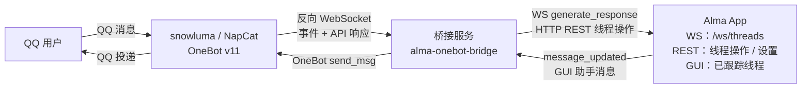

<p align="center">
  
</p>

# Alma OneBot Bridge

将 [Alma](https://github.com/anthropics/alma) 通过 [OneBot v11](https://github.com/botuniverse/onebot-11) 接入 QQ。Alma 通过反向 WebSocket 回复 QQ 私聊和群聊。

## 特性

- **Alma 管线**：消息走 Alma WebSocket 协议，SOUL、Memory、People Profiles、Skills 都会生效。
- **双向同步**：Alma GUI 消息转发到 QQ，QQ 消息创建或复用 Alma 线程。
- **群聊支持**：群聊需要 @bot 才响应，显示名优先使用群名片。
- **群聊历史**：桥接器把最近群聊消息放进上下文，并写入 `~/.config/alma/groups`。
- **Alma 群命令兼容**：`alma group list/history/search/context` 可以读取 QQ 群日志。主动发 QQ 消息走桥接器 HTTP 端点，因为 `alma group send` 面向 Telegram。
- **富消息处理**：桥接器把 QQ 表情转成文本，给图片/语音/视频加标签，并提取转发消息内容。
- **回复和 @提及**：桥接器处理 incoming 引用上下文和 outgoing 回复引用，群聊回复会 @发送者。
- **People Profiles**：桥接器为 QQ 用户创建 Alma People Profile，写入 `qq_id` 和 `telegram_id` frontmatter，保证伪装 Telegram 的 Alma 匹配链路继续工作。
- **消息分段**：长回复先按段落拆分，再按 QQ 的 4500 字限制拆分。
- **状态持久化**：Turso 保存线程映射、用户资料、QQ群名和群名片元数据。
- **安全认证**：WebSocket 可要求 `Bearer` token。HTTP 发送端点接受本机 loopback 或有效 token。
- **配置**：支持 TOML 配置文件和 macOS 设置窗口。
- **桌面应用**：macOS 菜单栏应用和 Windows 托盘应用管理桥接服务、设置、日志、启动/停止/重启和退出。

## 架构



桥接服务同时作为 OneBot 客户端的 **WebSocket 服务器** 和 Alma 内部聊天管线的 **WebSocket 客户端**（`ws://localhost:23001/ws/threads`）。运行时栈是 `smol` + Trillium（`trillium-smol`、`trillium-router`、`trillium-websockets`、`trillium-client`、`trillium-rustls`）；Alma 侧出站 WS 客户端使用 `trillium-websockets` re-export 的 `async-tungstenite`。

## 快速开始

### 前置条件

- [Alma](https://github.com/anthropics/alma) 在本地运行（`alma status` 验证）
- OneBot v11 客户端（如 [snowluma](https://github.com/nickyc975/snowluma) 或 NapCat），配置为反向 WebSocket
- Rust 工具链（1.85+，edition 2024）

### 编译

```bash
git clone <repo-url>
cd alma-onebot-bridge
cargo build --release
```

### Docker 镜像

推送版本 tag 后，CI 会自动发布 Linux amd64 服务镜像到 GitHub Container Registry：

```bash
docker pull ghcr.io/starlight02/alma-onebot-bridge:latest
# 或固定到某个发布版本，例如：
docker pull ghcr.io/starlight02/alma-onebot-bridge:0.2.2
```

运行时显式挂载配置和持久化状态目录：

```bash
mkdir -p ./docker-data/config ./docker-data/data ./docker-data/alma
cp config.toml.example ./docker-data/config/config.toml

# 先编辑 ./docker-data/config/config.toml。
# 如果 Alma 跑在 Docker 宿主机上，把 alma.api 设为 "http://host.docker.internal:23001"。
docker run -d --name alma-onebot-bridge \
  --restart unless-stopped \
  --add-host=host.docker.internal:host-gateway \
  -p 8090:8090 \
  -v "$PWD/docker-data/config:/config:ro" \
  -v "$PWD/docker-data/data:/data" \
  -v "$PWD/docker-data/alma:/home/bridge/.config/alma" \
  ghcr.io/starlight02/alma-onebot-bridge:latest
```

镜像默认读取 `/config/config.toml`，把默认数据库写入 `/data`，日志输出到 stdout/stderr 供 `docker logs` 查看，使用非 root 用户 `bridge`（`uid=10001`）运行，并暴露 `8090` 端口。

### macOS 菜单栏应用

macOS 应用从菜单栏运行 Rust 桥接服务。它负责启动/停止桥接服务，打开设置窗口，
写入 `~/.config/alma/bridge/config.toml`，并把日志放在同一目录。

构建 app bundle：

```bash
./scripts/build-macos.sh
```

输出路径：

```text
platforms/macos/build/Build/Products/Release/AlmaOneBotBridge.app
```

安装到 `/Applications` 后，启动台会显示它：

```bash
INSTALL_TO_APPLICATIONS=1 ./scripts/build-macos.sh
```

构建带开源协议确认页的 PKG 安装包：

```bash
./scripts/package-macos-pkg.sh
```

macOS 说明：[platforms/macos/README.md](./platforms/macos/README.md)。

### Windows 托盘应用

Windows 应用是 Rust + WinUI 托盘程序，桥接服务在进程内后台运行。发布包同时提供 Velopack MSI 和便携 ZIP：

```powershell
.\scripts\package-windows-velopack.ps1
.\scripts\package-windows-zip.ps1
```

Windows 说明：[platforms/windows/README.md](./platforms/windows/README.md)。

### 配置

复制示例配置并按需编辑：

```bash
cp config.toml.example config.toml
# 编辑 config.toml 设置你的参数
```

主要配置项：

```toml
[bridge]
port = 8090

[alma]
api = "http://localhost:23001"
# model = "anthropic:claude-sonnet-4-20250514"  # 覆盖默认模型
timeout = 120

[onebot]
api_timeout = 30
# access_token = ""  # 取消注释以要求 WS 连接携带 Bearer 令牌

[chat]
group_history_size = 30        # 群聊历史上下文条数（0 = 禁用）
# thinking_message = "思考中..."  # AI 生成前发送的提示消息（可选）
```

> **注意**：Git 忽略 `config.toml`。仓库只追踪 `config.toml.example`。

### 配置 OneBot 客户端

在 OneBot 客户端配置中添加反向 WebSocket 连接。以 snowluma 为例，编辑 `/app/snowluma-data/config/onebot_<qq_id>.json`：

```json
{
  "networks": {
    "wsClients": [
      {
        "name": "Alma",
        "url": "ws://<bridge-host>:8090/ws",
        "messageFormat": "array",
        "reportSelfMessage": false,
        "role": "Universal",
        "reconnectIntervalMs": 5000
      }
    ]
  }
}
```

如果 OneBot 客户端运行在 Docker 中，`<bridge-host>` 使用 `host.docker.internal`。

### 运行

```bash
# 启动桥接服务
./target/release/alma-onebot-bridge

# 开启调试日志
RUST_LOG=debug ./target/release/alma-onebot-bridge

# 本地 debugger 模式：使用临时 DB，并从 18090 起选择第一个可用端口
RUST_LOG=debug ./target/debug/alma-onebot-bridge --debugger
```

启动顺序：Alma → 桥接服务 → OneBot 客户端。

`--debugger` 模式用于 IDE/debugger 本地启动，避免和已运行的桥接服务抢同一个
`bridge-state.db` 或 `8090` 端口。它会使用按进程隔离的临时数据库，并从 `18090`
开始选择第一个可用端口。

## 配置参考

| TOML 键 | 默认值 | 说明 |
|---------|--------|------|
| `bridge.port` | `8090` | 监听端口 |
| `alma.api` | `http://localhost:23001` | Alma API 地址 |
| `alma.model` | *(Alma 设置)* | 覆盖 AI 模型 |
| `alma.timeout` | `120` | 生成超时（秒） |
| `alma.max_retries` | `2` | 生成失败重试次数 |
| `alma.retry_delay_ms` | `3000` | 重试基础延迟（毫秒，指数退避） |
| `database.path` | `bridge-state.db` | 数据库文件路径 |
| `people.dir` | `~/.config/alma/people` | People Profiles 目录 |
| `onebot.api_timeout` | `30` | OneBot API 超时（秒） |
| `onebot.access_token` | *(无)* | WS 连接和非 loopback HTTP 命令端点的 Bearer 令牌认证 |
| `chat.group_history_size` | `30` | 群聊历史上下文条数（0 = 禁用） |
| `chat.thinking_message` | *(无)* | AI 生成前的提示消息 |
| `chat.show_thinking` | `false` | 将思考块作为单独 QQ 消息发送 |

## 工作原理

### 消息流（QQ → Alma → QQ）

1. QQ 用户发送消息（群聊中 @bot）
2. OneBot 客户端通过反向 WebSocket 推送事件给桥接服务
3. 桥接服务提取文本、表情、媒体信息，记录到内存群聊历史和 `~/.config/alma/groups/<group_id>_<date>.log`
4. 桥接服务处理引用/回复上下文和转发消息提取
5. 桥接服务为用户创建 People Profile（如不存在）
6. 桥接服务查找或创建 Alma 线程（按 `private:{user_id}` 或 `group:{group_id}` 匹配）
7. 桥接服务通过 Alma WebSocket 发送 `generate_response`，附带发送者身份和上下文信息
8. Alma 使用完整管线处理（SOUL + Memory + People Profiles）
9. 桥接服务收集回复并发送回 QQ（群聊首条消息附带回复引用和 @提及）

### 双向同步（Alma GUI → QQ）

在 Alma GUI 中为已跟踪的线程发送消息时，回复会转发到对应的 QQ 会话。桥接器使用规范化后的可见文本去重，防止自身生成的回复被重复转发，同时不会误杀只是共享长前缀的不同消息。

### Alma 群命令和主动发送

桥接器会按 Alma 原生群日志格式写入 QQ 群日志：

```bash
alma group list
alma group history <qq_group_id> 100
alma group search <keyword>
alma group context <qq_group_id>
cat ~/.config/alma/groups/README.md
```

在 `~/.config/alma/groups/README.md` 里，桥接器只编辑自己的 `alma-onebot-bridge` 标记区块，区块外内容不动。成员和群名片放在 People Profiles。

对 QQ 群来说，`alma group send` 仍然是 Alma 内部的 Telegram 命令。主动发送 QQ 群消息请使用桥接器端点：

```bash
curl -s -X POST http://127.0.0.1:8090/qq/group/<qq_group_id>/send \
  -H 'Content-Type: application/json' \
  -d '{"message":"hello"}'
```

QQ 私聊主动发送使用 `POST /qq/private/<qq_user_id>/send`，JSON body 相同。非本机 loopback 请求需要配置 `onebot.access_token` 并携带 `Authorization: Bearer <token>`。

### 发送者身份

桥接器按 Alma 渠道桥接协议格式化消息：

- 群聊：`[From: Alice [id:12345678] [msg:12345]] 消息内容`
- 私聊：`[msg:67890] 消息内容`
- 引用回复：`[From: Alice [id:12345678] [msg:12346]] [Replying to Bob's message: "之前的话"] 这是回复`

群聊里 `[msg:N]` 位于 `[From: ...]` 发送者头部内，和 Alma 内置 Telegram/Discord 渠道格式一致；私聊不带 `[From: ...]` 头。`[msg:N]` 使用 OneBot 消息 ID；群聊中的 `[id:N]` 使用发送者 QQ 号。桥接器把 QQ 表情转成文本（如 `[emoji:斜眼笑]`），图片/语音/视频用标签描述。

## WebSocket 路径

桥接服务接受以下路径的 OneBot 连接：

- `/`：通用
- `/ws`：NapCat / snowluma 默认路径
- `/onebot/v11/ws`：Lagrange 默认路径

## 开发

```bash
# Debug 构建
cargo build

# 完整调试日志运行
RUST_LOG=debug cargo run

# Release 构建
cargo build --release
```

技术记录：[DEVELOPMENT_KNOWLEDGE_BASE.md](./src/docs/DEVELOPMENT_KNOWLEDGE_BASE.md)。

## 许可证

[AGPL-3.0](./LICENSE)，GNU Affero General Public License v3.0
