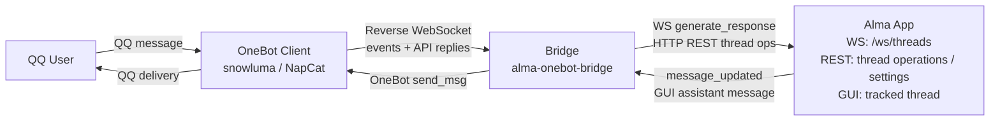

# Alma x OneBot v11 Reverse WebSocket Bridge

Build a Rust service that bridges the Alma local AI assistant with QQ (or any OneBot v11 IM) via a reverse WebSocket architecture. The bridge acts as a WS server for the OneBot client and a WS client for Alma's internal chat pipeline, enabling full AI-powered conversations over instant messaging.

## Architecture at a Glance



The bridge sits between two WebSocket connections: one from the OneBot client (reverse WS mode) and one to Alma's internal thread pipeline. It translates between the two protocols, correlates API calls via echo fields, and persists state across restarts.

## Prerequisites

- Rust toolchain (edition 2024, Rust 1.85+)
- Alma running locally (`alma status` to verify)
- OneBot v11 client configured for reverse WS (snowluma, NapCat, or Lagrange)

## Step 1: Project Initialization

Create a new Rust project and configure dependencies in `Cargo.toml`:

```toml
[package]
name = "alma-onebot-bridge"
version = "0.1.0"
edition = "2024"

[dependencies]
dirs = "6.0.0"
futures-util = "0.3.32"
reqwest = { version = "0.13.4", features = ["json"] }
serde = { version = "1.0.228", features = ["derive"] }
serde_json = "1.0.150"
tokio = { version = "1.52.3", features = ["full"] }
tokio-stream = "0.1.18"
tracing = "0.1.44"
tracing-subscriber = { version = "0.3.23", features = ["env-filter"] }
uuid = { version = "1.23.3", features = ["v4"] }
turso = { version = "0.7.0-pre.10", default-features = false }
tokio-tungstenite = "0.26"
warp = { version = "0.4.3", features = ["server", "websocket"] }
time = { version = "0.3", features = ["formatting", "parsing"] }
toml = "0.8"
```

Critical: Warp 0.4.x requires explicit `server` and `websocket` feature flags. Unlike 0.3.x where `server` was a default feature, `warp::serve()` will not compile without it. This is the single most common build failure when starting from scratch.

## Step 2: Module Structure

Organize the codebase into focused modules:

```
src/
  main.rs          -- entry point: tracing, config, state, routes, warp::serve
  config.rs        -- TOML config files plus defaults
  state.rs         -- shared state with Turso persistence
  onebot/
    mod.rs         -- re-exports api + event
    event.rs       -- OneBot v11 serde types, text extraction, @bot detection
    api.rs         -- echo-based WS API calls, PendingCalls, send_text_message
  handlers/
    mod.rs         -- re-exports http + ws
    http.rs        -- GET /health endpoint
    ws.rs          -- reverse WS connection lifecycle, event dispatch
  alma.rs          -- Alma REST API: create_thread, fetch_default_model
  alma_ws.rs       -- Alma WS client: generate_response protocol, event dispatch
  pipeline.rs      -- end-to-end message processing, bidirectional forwarding
  people.rs        -- auto-create People Profile markdown files
```

## Step 3: Warp WebSocket Server

Set up multi-path WS endpoints to accommodate different OneBot implementations. Different clients default to different paths, so listening on all three avoids connection rejections.

```rust
// In main.rs
let ws_handler = {
    let state = state.clone();
    move |ws: warp::ws::Ws| {
        let state = state.clone();
        ws.on_upgrade(move |socket| handlers::ws::handle_ws_connection(socket, state))
    }
};

let ws_root = warp::path::end().and(warp::ws()).map(ws_handler.clone());       // /
let ws_path = warp::path("ws").and(warp::path::end()).and(warp::ws()).map(ws_handler.clone()); // /ws
let ws_onebot = warp::path("onebot").and(warp::path("v11")).and(warp::path("ws"))
    .and(warp::path::end()).and(warp::ws()).map(ws_handler);                   // /onebot/v11/ws

let health = warp::path("health").and(warp::get()).and_then(handlers::http::health_handler);
let routes = health.or(ws_root).or(ws_path).or(ws_onebot);

warp::serve(routes).run(([0, 0, 0, 0], config.bridge_port)).await;
```

The health check endpoint (HTTP) and WS endpoints coexist on the same port. Warp's `warp::ws()` filter handles the upgrade handshake automatically.

## Step 4: WebSocket Split Pattern

When a OneBot client connects, split the WS into sink + stream. Create an `mpsc::unbounded_channel` for outgoing messages and spawn a writer task. Any task can send through the channel without contending for the sink.

```rust
let (ws_sink, ws_stream) = ws.split();
let (ws_tx, ws_rx) = mpsc::unbounded_channel::<Message>();
let mut ws_rx = UnboundedReceiverStream::new(ws_rx);

// Writer task: channel -> WebSocket
let writer = tokio::spawn(async move {
    let mut sink = ws_sink;
    while let Some(msg) = ws_rx.next().await {
        if let Err(e) = SinkExt::send(&mut sink, msg).await { break; }
    }
});
```

The same pattern applies to the Alma WS connection (using `tokio-tungstenite` instead of Warp's WS type).

## Step 5: Echo Correlation Mechanism

Use this pattern for synchronous-style API calls over the shared WebSocket connection with the OneBot client. Events and API responses flow through the same WS, so the `echo` field disambiguates them.

The fundamental discrimination rule for incoming WS messages:
- Has `echo` + `retcode` fields -> API response (correlate to pending call)
- Has `post_type` field -> Event (dispatch to handlers)

Implementation approach:

1. `PendingCalls` wraps `Arc<Mutex<HashMap<String, oneshot::Sender<ApiResponse>>>>`.
2. `call_api` generates a unique echo (`bridge-{uuid}-{action}`), creates a oneshot channel, stores the sender in the pending map, sends the request with the echo, and awaits the receiver with a timeout.
3. `try_resolve_api_response` looks up the echo in the pending map, removes the sender, and resolves the oneshot.

```rust
pub async fn call_api(
    ws_tx: &mpsc::UnboundedSender<Message>,
    pending: &PendingCalls,
    action: &str,
    params: serde_json::Value,
    timeout_secs: u64,
) -> Result<ApiResponse, String> {
    let echo = format!("bridge-{}-{}", uuid::Uuid::new_v4(), action);
    let (resp_tx, resp_rx) = oneshot::channel();
    pending.0.lock().await.insert(echo.clone(), resp_tx);

    let request = ApiRequest { action: action.to_string(), params, echo: echo.clone() };
    ws_tx.send(Message::text(serde_json::to_string(&request)?))?;

    let result = timeout(Duration::from_secs(timeout_secs), resp_rx).await;
    pending.0.lock().await.remove(&echo);
    // ... handle result
}
```

This enables multiple concurrent API calls over a single WS connection, each correlated independently.

## Step 6: OneBot v11 Event Handling

Parse incoming WS messages as `OneBotEvent` structs. Spawn a task for each message event so the reader loop is never blocked on AI generation.

Key behaviors:
- Group messages require `@bot` mention; strip the mention before passing to Alma
- Use array format for message segments (`[{"type":"text","data":{"text":"..."}}]`), not CQ string format
- Extract text by concatenating all `type: "text"` segments
- For group chats, prefer the group card (sender.card) over the QQ nickname

## Step 7: Alma Integration

Use the Alma WebSocket protocol directly (not `alma run` CLI) for the best integration. The WS protocol ensures messages persist in threads and are visible in the GUI, with full access to SOUL, Memory, People Profiles, and Skills.

Thread creation uses the REST API:
```
POST http://localhost:23001/api/threads
Body: {"title": "QQ Group 100200300"}
Response: {"id": "<thread_id>"}
```

AI generation uses the WS protocol:
```json
{
  "type": "generate_response",
  "data": {
    "threadId": "<thread_id>",
    "model": "anthropic:claude-sonnet-4-20250514",
    "userMessage": {
      "role": "user",
      "parts": [{"type": "text", "text": "user message"}]
    }
  }
}
```

Response collection: accumulate `message_delta` events (only `text_append` with `partType: "text"`), then resolve on `thread_generating {isGenerating: false}`. Strip `<think>...</think>` blocks from accumulated text.

Per-thread generation guards (`HashMap<String, Arc<Mutex<()>>>`) serialize concurrent `generate()` calls for the same thread, preventing pending map corruption.

Do not open or write Alma's `chat_threads.db` from this external bridge. Built-in bridges can
maintain Alma's `channel_mappings` because they run inside Alma's own process boundary; an
external reverse-WS bridge must avoid cross-process DB locks. Keep QQ session-to-thread
state in the bridge's local Turso database, create threads through Alma REST, and spoof
Telegram behavior through `source`, Telegram-style message text, and `ephemeralContext`.

For full Alma WS protocol details and the event sequence, read `references/alma-ws-protocol.md`.

## Step 8: Message Pipeline

The end-to-end flow for each QQ message:

1. Extract plain text from message segments
2. For group messages, record observed text/media into the in-memory ring buffer and `~/.config/alma/groups/<group_id>_<date>.log` before the @bot gate
3. Ensure People Profile exists for the sender
4. Look up the Alma thread in the bridge's local `threads` table; if missing or stale, create/check it through Alma REST
5. Format message like built-in Telegram:
   - group: `[From: 萌依 [id:123] [msg:456]] msg`
   - private: `[msg:456] msg`
   - do not split `[msg:N]` into a separate line outside the group sender header
6. Send via Alma WS (`generate_response`) and await reply
7. Split reply by paragraphs (`\n\n`), then by QQ's ~4500 char limit
8. Send each chunk via OneBot `send_msg` API
9. Register sent replies for dedup (bidirectional forwarding) and append Alma's group replies to `~/.config/alma/groups`

The bridge also exposes local HTTP command endpoints for active sends from Alma tools:

- `GET /qq/groups`: list known QQ groups and current OneBot connection status
- `POST /qq/group/<group_id>/send` with `{"message":"..."}`: send a QQ group message
- `POST /qq/private/<user_id>/send` with `{"message":"..."}`: send a QQ private message

Loopback requests are allowed. Non-loopback requests require `onebot.access_token` via
`Authorization: Bearer <token>` or `?token=...`. For QQ groups, do not use Alma's
`alma group send`; it is Telegram-specific.

Inside `~/.config/alma/groups/README.md`, the bridge must only update its own
`alma-onebot-bridge` marked section and must preserve content outside that section. The
bridge section is a group directory only; it must not list known members or group cards.
Keep identity/group-card details in People Profiles.

## Step 9: Bidirectional Forwarding

Messages typed in the Alma GUI are forwarded to QQ, and vice versa. The architecture:

```
Alma WS reader -> internal channel -> drain task (500ms poll) -> broadcast channel -> OneBot handler -> dedup -> send_msg -> QQ
```

Critical: Use `message_updated` events (not `message_added`) for forwarding. `message_added` fires with empty text for assistant messages. Filter by generation state to avoid forwarding partial updates during active generation. Track generating threads in a `HashSet<String>`.

Dedup compares the first 100 characters of text, keeping the last 20 entries per thread. This prevents echo loops when the bridge sends a reply and Alma also records it.

## Step 10: State Persistence with Turso

Use a local SQLite-compatible Turso database for persisting thread mappings, user profiles,
QQ group titles, and observed group cards:

```sql
CREATE TABLE threads (
    session_key TEXT PRIMARY KEY,   -- "private:123456789" or "group:100200300"
    thread_id TEXT NOT NULL
);
CREATE TABLE profiles (
    user_id TEXT PRIMARY KEY,
    profile_name TEXT NOT NULL
);
CREATE TABLE groups (
    group_id TEXT PRIMARY KEY,
    title TEXT NOT NULL DEFAULT '',
    last_active TEXT NOT NULL DEFAULT '0'
);
CREATE TABLE group_members (
    group_id TEXT NOT NULL,
    user_id TEXT NOT NULL,
    display_name TEXT NOT NULL,
    last_seen TEXT NOT NULL DEFAULT '0',
    PRIMARY KEY (group_id, user_id)
);
```

An in-memory `HashMap<String, String>` provides reverse lookup (thread_id -> session_key) for bidirectional forwarding. This is populated lazily on `get_thread_id()` / `set_thread_id()` calls and rebuilt across restarts.

## Step 11: People Profile Auto-Creation

Create markdown files at `~/.config/alma/people/{sanitized_nickname}.md` with YAML frontmatter:

```markdown
---
qq_id: "12345678"
username: "Alice"
---
# Alice
- QQ user, ID: 12345678
- Nickname: Alice
- First interaction: 2026-06-19
```

Use `username` (not `qq_nickname`) in frontmatter to match Alma's standard field naming. Fetch detailed user info via OneBot's `get_stranger_info` API for better nicknames.

## Step 12: Configuration

Use TOML files for bridge settings. Environment variables are reserved for runtime
metadata such as log paths.

The bridge reads config in this order:

1. `config.toml` in the current directory
2. `bridge.toml` in the current directory
3. `~/.config/alma/bridge/config.toml`
4. defaults

| TOML Key | Default | Purpose |
|---|---|---|
| `bridge.port` | `8090` | WS/HTTP listen port |
| `alma.api` | `http://localhost:23001` | Alma API base URL |
| `alma.model` | *(Alma settings)* | Override AI model |
| `alma.timeout` | `120` | Generation timeout (s) |
| `database.path` | `bridge-state.db` | Database file path |
| `onebot.api_timeout` | `30` | OneBot API timeout (s) |
| `onebot.access_token` | *(none)* | Bearer token for WS auth and non-loopback HTTP command endpoints |

Default port is 8090 (not 8080) because port 8080 is commonly occupied by Docker/nginx-ui on development machines.

## Step 13: Container Environment

When the OneBot client runs in a container (OrbStack, Docker), use `host.docker.internal` as the bridge hostname. The container bridge network cannot directly reach LAN devices.

snowluma config example (`onebot_<qq_id>.json`):
```json
{
  "networks": {
    "wsClients": [{
      "name": "Alma",
      "url": "ws://host.docker.internal:8090/ws",
      "messageFormat": "array",
      "reportSelfMessage": false,
      "role": "Universal",
      "reconnectIntervalMs": 5000
    }]
  }
}
```

## Common Pitfalls

These are the issues that cost the most debugging time. Detailed explanations and fixes are in `references/pitfalls.md`.

1. **Warp 0.4.x `server` feature** - not default, must be explicit in Cargo.toml
2. **`message_added` has empty assistant text** - use `message_updated` instead
3. **`message_updated` fires multiple times** - filter by generation state
4. **Turso `Statement` takes `&mut self`** - prepared statements must be mutable before `query()` or `execute()`
5. **No REST endpoint for message sending** - must use Alma WS protocol
6. **WebSocket split pattern** - cannot share `SplitSink` across tasks, use mpsc channel
7. **Per-thread generation guards** - concurrent generate() for same thread corrupts pending map
8. **QQ ~4500 char limit** - split by paragraphs first, then by character limit

## Verification

After building, verify the bridge works end-to-end:

1. `cargo build --release` compiles
2. Start Alma, then the bridge, then the OneBot client (in that order)
3. Check `GET http://localhost:8090/health` returns 200
4. Send a private QQ message to the bot; receive an AI reply
5. Send a group message with @bot; receive an AI reply
6. Type in the Alma GUI for a tracked thread; verify forwarding to QQ
7. Restart the bridge; verify local thread mappings persist (no new threads created)
